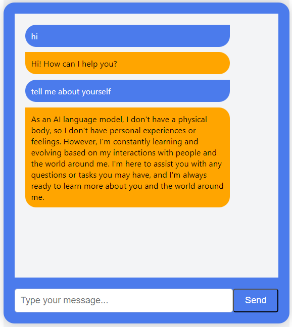

# Chrome Extension Name


The "Jarvis" is a powerful and user-friendly extension for Google Chrome that enhances your web browsing experience. It provides an efficient ai chat which can give you a quick response and makes online activities more convenient and efficient. 

## Table of Contents
- [Installation](#installation)
- [Usage](#usage)
- [Working](#DEMO)

## Installation

1. Clone this repository:
   ```shell
   git clone https://github.com/ravix007/Chrome_Extension.git
   ```

2. Open Google Chrome.

3. Go to `chrome://extensions/`.

4. Enable "Developer mode."

5. Click on "Load unpacked" and select the directory where you cloned the extension.

## Usage

Once the extension is installed, you'll typically find its icon in the Chrome toolbar. Click on the extension icon to access the Ai ChatWindow and start asking questions.




## Demo


https://github.com/raviX007/Chrome_Extension/assets/91694681/5573bccb-dd14-457b-a5ca-d21a4aa985f9


